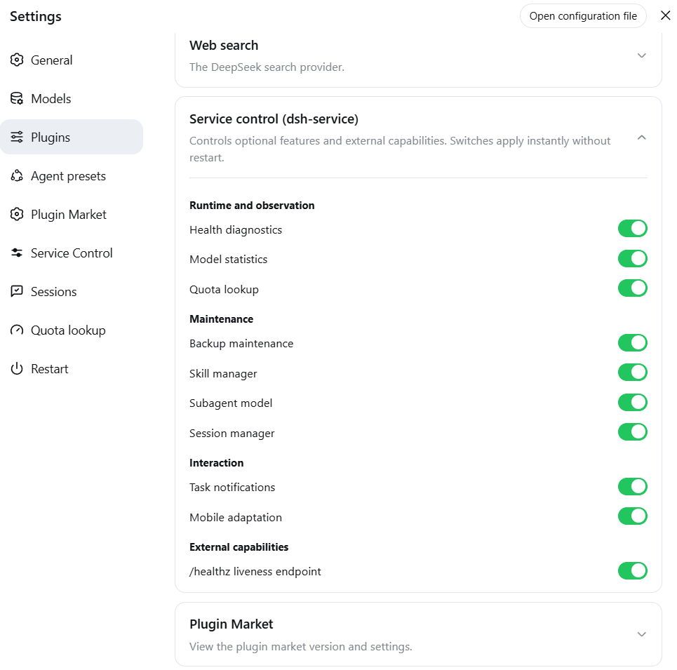
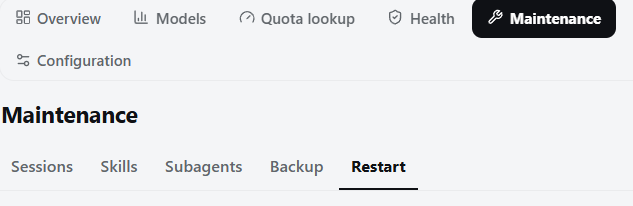
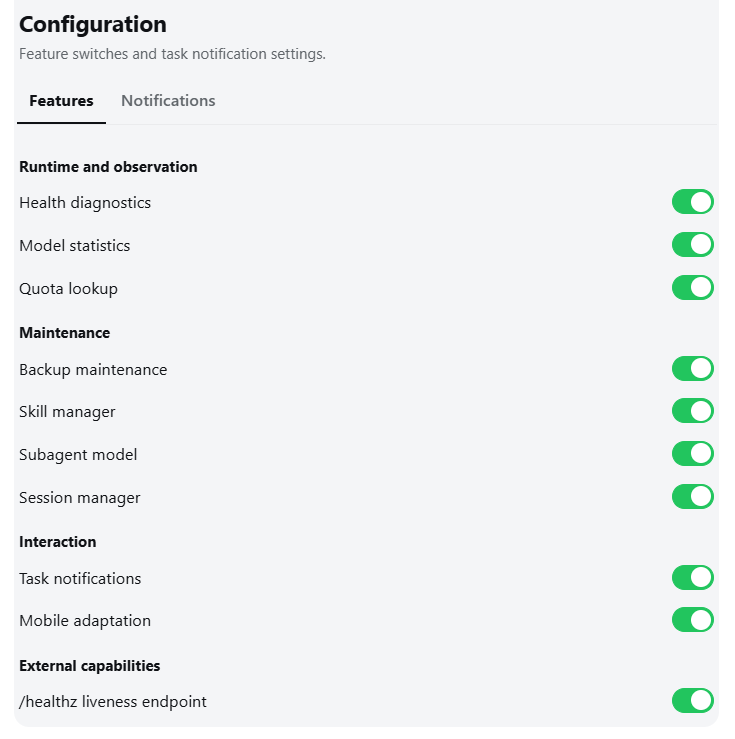
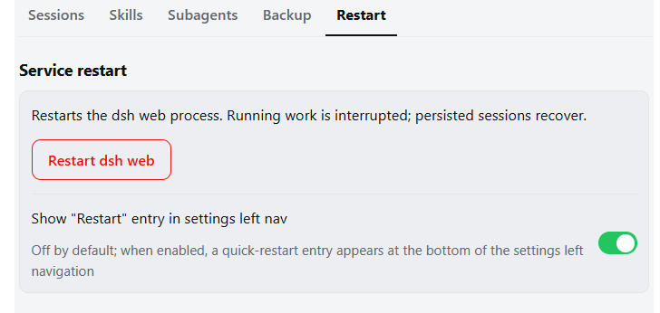
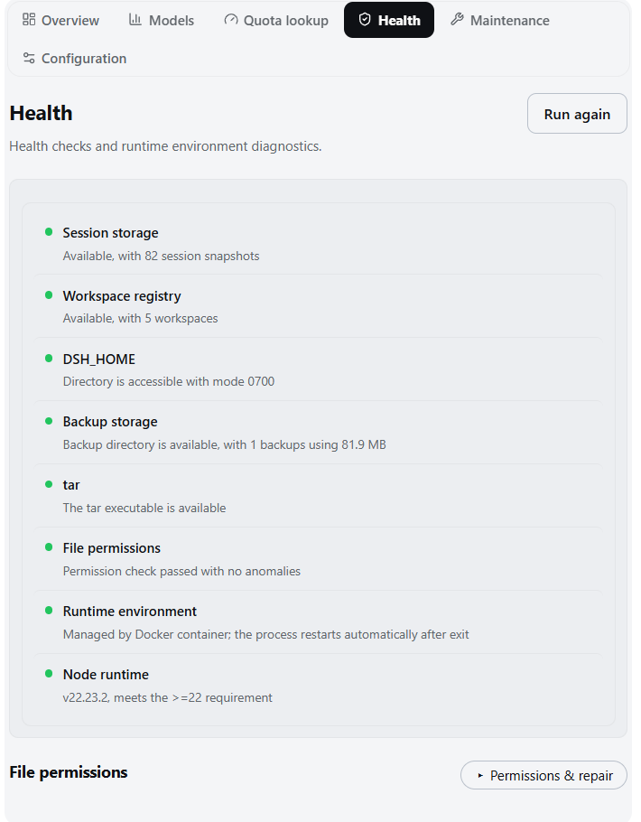
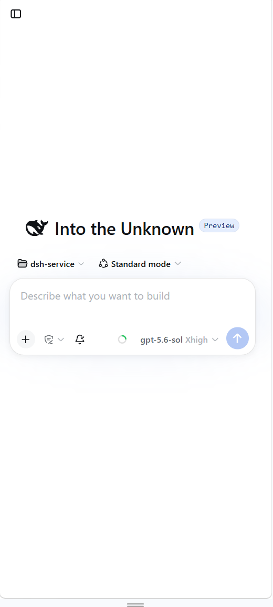
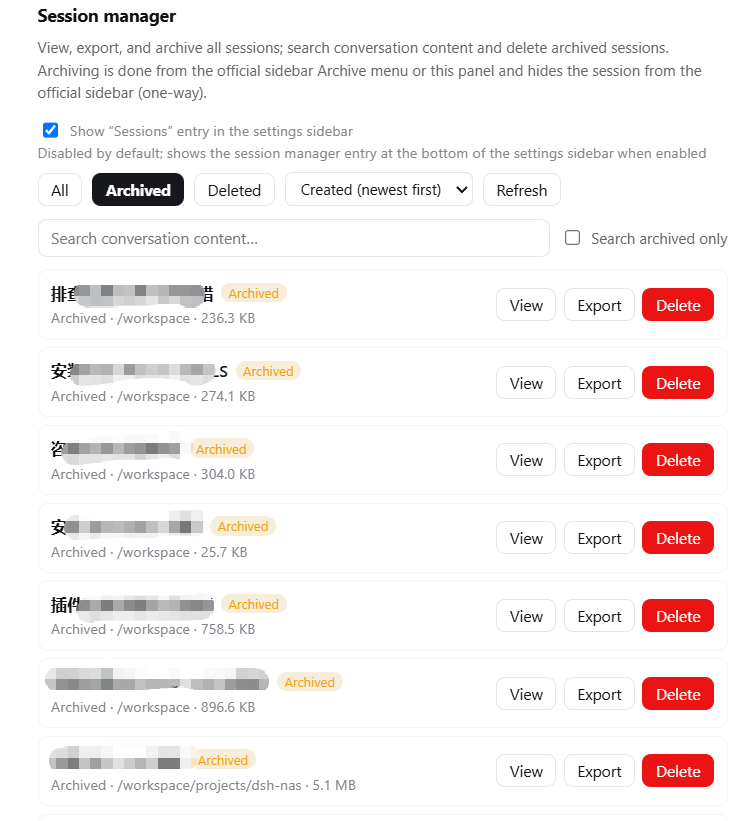
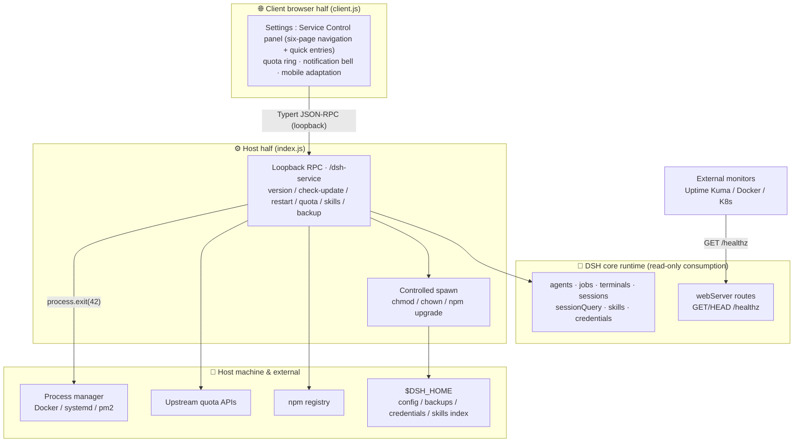

<div align="center">

[中文](./README.md)

# 🛠️ dsh-service

<p align="center">
  <strong>A service-control &amp; operations plugin for DeepSeek Harness (DSH) Web.</strong><br>
  <em>DeepSeek Harness (DSH) Web 服务控制与运维插件。</em>
</p>

[](package.json)
[](LICENSE)
[](https://github.com/deepseek-ai/deepseek-harness)
[](https://cordis.moe/)
[](https://github.com/gehennawu/dsh-service)
[](https://github.com/gehennawu/dsh-service/issues)
[](https://awesome-dsh-plugin.com)

<p align="center">
  <a href="#-features">Features</a> •
  <a href="#-architecture">Architecture</a> •
  <a href="#-installation">Installation</a> •
  <a href="#-automatic-restart">Automatic restart</a> •
  <a href="#-platform-support">Platform support</a> •
  <a href="#-security-design">Security design</a> •
  <a href="#-faq">FAQ</a> •
  <a href="#-contributing">Contributing</a> •
  <a href="#-license">License</a>
</p>

---

</div>

A service-control and operations plugin for DSH Web: safe restart, version management and one-click upgrade, health diagnostics, model-usage statistics, quota lookup, backup management, task notifications, skills management, session management, and Linux file-permission maintenance.


## 📑 Contents

- [🚀 Features](#-features)
  - [Version and updates](#version-and-updates) · [Safe restart](#safe-restart) · [Health diagnostics](#health-diagnostics) · [Model statistics](#model-statistics)
  - [Quota lookup](#quota-lookup) · [Backup management](#backup-management) · [Skills management](#skills-management) · [Subagent model](#subagent-model)
  - [Task notifications](#task-notifications) · [Session manager](#session-manager) · [Mobile adaptation](#mobile-adaptation) · [External liveness probe](#external-liveness-probe)
- [🏗️ Architecture](#-architecture)
- [⚡ Installation](#-installation) · [🔄 Automatic restart](#-automatic-restart) · [🖥️ Platform support](#-platform-support)
- [🔒 Security design](#-security-design) · [❓ FAQ](#-faq) · [🤝 Contributing](#-contributing) · [📄 License](#-license)

## 🚀 Features

The Settings "Service Control" panel has a six-page navigation: **Overview · Model stats · Quota lookup · Health · Maintenance · Configuration**; "Maintenance" aggregates five subpages — Sessions · Skills · Subagents · Backups · Restart — and "Configuration" aggregates Features · Task notifications. Restart, Quota lookup, and Sessions can each enable a **quick entry in the settings left navigation** (off by default; the Skills and Subagents sidebar entries were removed).

Under **Plugins → Plugin configuration**, ten host-level switches: **Health diagnostics, Model statistics, Quota lookup, Backup maintenance, Task notifications, Skill manager, Subagent model, Session manager, Mobile adaptation, `/healthz` liveness endpoint** (all on by default except Mobile adaptation). All are live settings: disabling hides the UI, stops polling/subscriptions, and makes the host reject that capability; Overview and Restart stay available.



### Overview (six sections)

- Status summary (error → warning → info → normal aggregation with a status dot) → actionable items (only when present) → version and runtime → metrics grid → fixed core actions (health check / quota lookup / create backup, gated by feature switches) → recent errors (rendered only when non-empty, collapsed by default)
- Aggregation rules: any health/diagnostics/backup/statistics/quota/restart failure is error; permission issues and non-advisory diagnostic warnings are warning; available updates, manual-start runtime, and no backups yet are info (high quota-window usage only shows as a progress bar on the quota page and no longer surfaces as an overview reminder)

### Maintenance and Configuration pages





- Maintenance groups Sessions, Skills, Subagents, Backups, and Restart; it remembers the most recent subpage and falls back to an available item when a feature is disabled
- Configuration groups feature switches and task notifications; switches are grouped and apply live, while the Notifications entry stays visible but disabled when that feature is off

### Version and updates

- Shows the current DSH and plugin versions, linking to GitHub Releases
- Automatically checks npm **stable + preview** (latest / next dist-tags); when a new version exists, an inline expandable compares them, each with npmjs and npmmirror links
- One-click upgrade with automatic restart; when no process manager is detected, it confirms the consequences first, keeps running, and shows manual-restart instructions

### Safe restart



- Detects active agents, background jobs, and terminals before restart; lists them and requires explicit confirmation
- `/restart` also works in conversations; automatically refuses while work is running
- Probes the new process after restart and reloads the page; manual reload offered after 60 seconds
- Optional "Restart" entry in the settings left navigation (off by default), sharing the same confirmation flow as the "Maintenance → Restart" subpage
- A suspected manual terminal launch warns that nothing will bring the process back and gets a yellow caution in Health

### Health diagnostics



- Uptime, memory, session count, active agents, and background jobs; a "Process and runtime" card shows platform, architecture, and Node version
- Full diagnostics: session storage, workspace registry, backup storage, tar availability, file permissions, runtime environment, and Node version — rendered as a two-line check list (name + status dot / detail) with abnormal rows locally emphasized
- **Plugin health checks**: checks for anomalies only (the official plugin page already provides the full inventory and toggles, so no duplicate list here) — a failed plugin or one waiting on dependencies marks the check as error/warning, while fresh pending/loading fibers receive a short startup grace period; disposed or unknown states are explicit informational rows and do not become warnings. Affected plugins are listed below the check list with clipped, redacted failure text and missing deps; failed plugins can be reloaded behind a two-step confirmation (only entries the host confirmed as failed); manually disabled plugins (built-in or custom) never count as an anomaly
- **Plugin compatibility**: every enabled plugin is scanned against the interfaces DSH alpha versions have removed or changed (client suppliers, the SQLite persistence backend, chat/status-line style hashes, deprecated attributes) — a hit flags the plugin as "possibly incompatible" with the concrete reason (e.g. "Declares the removed client supplier @deepseek-ai/dsh-client-runtime"). Tiered verdict: only a real `require`/`import` reference is flagged "possibly incompatible"; a supplier that appears only in the manifest (unused in code) falls back to a gray "stale declaration" note — the official loader silently skips missing suppliers, so it is harmless and merely signals the author to clean up. Before upgrading to alpha or right after doing so, you can see whether third-party plugins kept up; fully local scan with cached results, zero network
- File-permission deep scan and repair (two-step confirmation) behind a collapsed "Permissions & repair" section
- Suspected manual launch → yellow "no restart assurance" caution; no backups is informational only and never lights the ⚠

### Model statistics


- 7-day stacked bar chart of input / output / cache tokens; filter by project, hover for exact values; legend and refresh live in a unified region header; an accessible text summary accompanies the chart
- Per-model horizontal bars with a "Today / Last 7 days / All time" toggle
- Last-24-hour model/tool errors (collapsed by default, rendered only when present)
- Steps whose provider reports no token usage are excluded

### Quota lookup


- Provider cards keep the existing window presentation (label + percent / independent bar / reset countdown); **advanced configuration** (credentials, kind switching, manual reset entries) is collapsed per card by default
- A **quota ring** in the conversation composer follows the current session's model provider and shows the tightest budget window (<80% green, ≥80% amber); clicking opens a detail panel that becomes a centered overlay on narrow screens
- Built-in adaptations:

| Provider | Data source |
| --- | --- |
| DeepSeek Platform | Official balance + peak/off-peak ribbon and countdown |
| Zhipu GLM Coding Plan | Official endpoint: 5-hour rolling / weekly / monthly MCP windows + peak/off-peak ribbon and countdown (peak = Mon–Fri 14:00–18:00 UTC+8) |
| OpenCode Go | `{baseURL}/usage` |
| OpenRouter | Credits used % |
| Kimi / SiliconFlow | CNY balance |
| StepFun Balance | Official `GET /v1/accounts` (API key, com/ai dual domains) |
| StepFun Step Plan | Console BFF subscription quota (Oasis-Token console session; 5-hour/weekly windows vs Credit pool auto-detected) |
| Xiaomi MiMo Token Plan | Console-origin plan quota (web session cookie) |
| CLIProxyAPI deployment | Official remaining quota of each OAuth upstream account |

- Credentials go into the DSH credential store (`$DSH_HOME/.credentials.yaml`, hot-effective): an API key, the CPA management key, the Xiaomi console cookie, or the StepFun Step Plan console token (Oasis-Token; the `Oasis-Webid` is derived from the token automatically — no manual entry)
- Anti-rate-limit pacing: 60 s result cache, exponential backoff (30 s doubling, capped at 15 min); auto-query can be set to manual-only / 1 / 2 / 5 / 10 minutes
- API keys are resolved only inside the host process; the browser receives normalized window data only; unadapted providers are never requested

### Backup management


- Backup records use light two-line rows (name on the first line, size · time on the second, separator layout; same style as the session list)

- Creates `.tar.gz` archives of sessions, configuration, and plugin-profile manifests; sessions are snapshotted through the persistence layer's stable-read seam (active-agent writes no longer fail creation), and creation shows one continuous phase progress bar (copy / pack / verify / publish, step counter 1/4–4/4, real percentage during copy)
- Export download / import upload / delete (two-step confirmation); unlimited, never auto-pruned; imported archives must pass the same integrity inspection used by restore
- **Integrity inspection** validates gzip/tar structure, paths, and entry types. Only `sessions`, the three allowlisted config files, and `profiles/<name>/package.json` are accepted; traversal, links, special files, unknown content, corrupt archives, and invalid profile manifests are rejected
- **Restore preflight** produces a single-use five-minute plan showing the full sessions replacement, config replacements/removals, and profile-manifest updates. Final commit rechecks the archive SHA-256 and current-target fingerprint; any drift rejects the restore
- Restore uses a transaction journal and rollback directory: sessions are replaced in full, config is made exact to the snapshot, and profiles update package.json only while keeping node_modules, credentials, and attachments. Managed runtimes restart automatically; manual launches receive hand-restart instructions

### Skills management


- Lists local skills in three sections — **auto-loaded / manual-only / fully disabled**; same-name shadowing marks both copies, bundled directories are read-only
- Two switches edit the SKILL.md frontmatter directly (`disable-model-invocation` / `user-invocable`); changes go live within ~200 ms
- Entries with legacy camelCase keys are dropped by the official parser: ⚠ warning + one-click canonical fix
- ✨ Fill with AI: pick a model to draft a description (follows the UI language), saved to a plugin sidecar index — **SKILL.md is never modified**; one-click batch fill runs in the host background and can be cancelled. Already-annotated skills are listed separately in the plan and are only overwritten after a "Confirm forced refill" second confirmation (annotating no longer blocks future batch fills forever); completion-log timestamps use your local timezone

### Subagent model


- Three modes: **Default** (no override) / **Follow main model** (the provider/model actually used by the latest main-conversation request) / **Custom** (pin every unspecified subagent)
- A provider/model explicitly carried by the delegation always wins; pinned presets are never overridden
- Custom mode optionally selects a **reasoning effort**: the dropdown appears only for the exact provider/model when its adapter declares selectable levels; leaving it empty means "use the target model default", materialized by the adapter
- Values come from adapter metadata (`reasoning.efforts[].id`); effort ids are opaque to the host. Models with no declared levels disable the dropdown and show a hint
- **inherit / follow / feature gate off** inject no provider, model, or reasoning effort at all; subagents that carry an explicit provider/model are unaffected
- **Fallback models (in order)** — both Follow and Custom modes accept an ordered fallback list: when the primary route is unavailable (channel unloaded, or quota state marks it unserviceable), the next model is tried in order; if none works, delegations fall back to native inheritance instead of failing. Fallback entries pass the same allow-list check as the primary route, with an optional reasoning effort per entry
- **Conversation-page visibility** — every turn that spawned subagents shows a small line under its last message listing the models those subagents actually ran on, e.g. `Subagent models: cpa/gpt-5.6-luna (xhigh) · opencode-go/deepseek-v4-flash (max)` — covering fallback hits, explicit routes, and inherited sources, so you can verify the custom route at a glance; a session-level aggregate line also sits under the composer (20s refresh, independent of turn data — when compaction folds the delegation tool calls the official counter and the per-turn line vanish together, and the aggregate line covers from the host dispatch records, visible in any view; switch it off independently from Maintenance → Subagent, keeping only the per-turn line); records live in host memory (survive page reloads, cleared on process restart). Works regardless of the official "assign subagent models" switch
- Config stored in `$DSH_HOME/dsh-service-subagent-route.json` (atomic writes, `0600`); one-click reset

### Task notifications


- Browser notification when a root session finishes its turn or any session needs approval / plan review / an answer; subagent completion is silent; clicking focuses the page
- Subagent approval / plan-review / question requests still notify
- Four independent toggles: master, task completion, approvals & questions, composer-bell visibility
- The composer bell toggles the master switch quickly; all toggles persist across reloads

### Mobile adaptation



- Off by default; active only below a 1024 px viewport (phones / narrow windows), desktops unaffected
- Sidebar becomes a drawer, details column is hidden on mobile (matching the official narrow-screen behavior), modals become full-screen panels, settings left nav a horizontal top strip
- Scroll immersion: inside a conversation, swiping down auto-hides the header and composer for full-screen reading; swipe up, reaching the bottom, or focusing the composer brings them back, with a resident bottom handle as a manual toggle. Programmatic scrolling (streaming pinning, anchor jumps) never triggers it
- The "Back to bottom" button is shifted flush right on mobile (no more large empty strip); a matching circular up-arrow now sits above it on all platforms, jumping to the previous user message on each click for step-by-step back navigation. Targets outside the loaded history auto-trigger the official "load earlier" action; the button hides once you reach the very top and reappears when you scroll back down
- Transparent large-JSON compression (≥4KB auto gzip/brotli per `Accept-Encoding`) speeds up long session histories
- Adds `viewport-fit=cover` with safe-area avoidance, disables double-tap zoom, keeps inputs ≥16px against iOS focus zoom
- `?dshsvc-mobile-debug=1` shows a floating diagnostics chip (debugging only)

### Session manager



- **View**: one unified list for sessions (running / cold / archived) with status badges, workspace, event count, and size; the list sorts by creation time (newest/oldest first), by title, or **by project** (workspace path, newest first within a project); **starts on the “Archived” view by default**, and each of the All / Archived / Deleted filters fetches its own subset from the host **once,** then keeps it in a **module-level cache** — switching filters sends no requests, and **closing and reopening the panel renders the cache instantly while quietly refreshing the current view once in the background** (only a page reload clears the cache), with a “Refresh” button for a forced refetch of the current view; normal lists also provide a “Select multiple” button; in that mode, clicking anywhere on a session row selects or clears it without requiring a precise checkbox click, while one-click select-all / clear-all remains available for the current filtered result, and selected rows use a slim brand-colored edge without replacing their background; the toolbar shows eligible counts and runs batch export / archive / delete actions (changing filters, searching, or opening details exits selection mode automatically); sizes are never shipped with the list — each row fetches its size lazily (double-cached in the module and in host memory: reopened panels and refreshed pages reuse it, cleared on delete); the detail page walks events as paged cards (single-slot host snapshot cache: paging and reopening the same session never re-reads the log, live sessions stay fresh within 30 seconds), with **event bodies rendered as official Markdown** (reusing the platform renderer `MarkdownText`, same look as the chat UI: code blocks, lists, tables, math — raw HTML and unsafe links are rejected by default; older DSH shells without the renderer automatically fall back to plain text), and consecutive system events collapse into a countable block by default — click to expand the details; **entering a detail remembers the list scroll position and returning to the list drops you back exactly where you were** (reusing the official panel's scroll container; changing the filter or search while in the detail discards the restore)
- **Export**: one-click or batch download through the official export path (one full ZIP per session, including subagents and attachments) — the host never assembles a package itself
- **Archive**: archive one or many non-running sessions; archived sessions disappear from the official sidebar (official behavior), and the official UI cannot unarchive
- **Content search**: full-text semantic search over conversations (case-insensitive, whitespace-flexible) with cross-session hits (matched text is highlighted; multiple matches show seq chips for one-click jumps) → **hit-window view**: opening a result centers a context window on the matched seq (15 events on each side; the matched event gets a HIT badge, is highlighted, **auto-scrolled into view and flashes for 2 seconds**), with **previous / next match** navigation and navigator seq chips for direct jumps (mirroring dsh-session-kb's Locate interaction); the window can keep loading later events; optionally restricted to the archived zone
- **Delete**: Only archived sessions can be deleted, and a session that becomes live is rejected again immediately before execution; the two-phase confirmation shows its id / title / workspace / size, persists the deletion record atomically first, and only then removes the log directory; deleted records stay visible (read-only) under the Deleted filter
- Entry: the “Sessions” subpage under “Maintenance” (on by default); the optional settings-sidebar entry is off by default
- Delete records live at `$DSH_HOME/dsh-service-sessions-deleted.json` (atomic write, `0600`, title/time only — no content, not recoverable)

### External liveness probe

- `GET` / `HEAD /healthz` returns an empty 200; other methods return 405
- Suitable for Uptime Kuma, Docker, Kubernetes, and other external monitors

## 🏗️ Architecture

The plugin is a Cordis two-half structure: the **Host half (`index.js`)** owns all capabilities and data access, while the **Client half (`client.js`)** only renders UI in the browser; the two sides communicate over Typert JSON-RPC on a single-layer absolute path channel `/dsh-service`, with `loopback` authority throughout.



Key contracts:

- **Loopback only**: capabilities are exposed solely through the `/dsh-service` loopback channel; webServer routes return only information-free status codes
- **Restart = `process.exit(42)`**: the plugin only sends an exit signal; an external process manager brings it back — no manager, no restart guarantee
- **Zero input concatenation**: the browser side never supplies URLs, package names, commands, or paths; all commands go through a host-side whitelist
- **Credentials never leave the host**: API keys are resolved only inside the host process; the browser receives only normalized window data

## ⚡ Installation

| Method | Command |
| --- | --- |
| npm (recommended) | `dsh plugin --profile web add @gehennawu/dsh-service` |
| GitHub | `dsh plugin --profile web add github:gehennawu/dsh-service` |
| Local development | `dsh plugin --profile web add link:/path/to/dsh-service` |

Restart DSH Web after installing or updating:

```sh
dsh web
```

Open DSH Web Settings and select **Service Control**.

## 🔄 Automatic restart

The plugin only sends an exit signal; it does not start the process again. Without a process manager, restart stops DSH Web.

The plugin passively detects a process manager (environment variables, `/.dockerenv`, `/proc/1/cgroup`, terminal TTY): with Docker/systemd/pm2/supervisord/Kubernetes detected it restarts as usual; when nothing is detected and stdin/stdout are an interactive terminal, it treats the launch as manual — flagged in Health diagnostics and switching one-click upgrade to keep running with manual-restart instructions. Heuristics cannot cover redirected output or wrappers such as NSSM/WinSW; declare `DSH_SERVICE_RUNTIME_ENV=managed|manual` explicitly.

### Docker Compose

```yaml
services:
  dsh:
    restart: unless-stopped
```

### systemd

```ini
[Service]
ExecStart=/usr/local/bin/dsh web --host 127.0.0.1
Restart=on-failure
RestartSec=2
```

### pm2

```sh
pm2 start "dsh web --host 127.0.0.1" --name dsh-web
```

## 🖥️ Platform support

| Environment | Plugin features | Automatic recovery | Verification |
| --- | --- | --- | --- |
| Linux + Docker Compose | Supported | Supported with a restart policy | Verified |
| Linux + systemd / pm2 | Expected to work | Managed externally | Not separately tested |
| macOS / Windows + pm2 or similar | Not blocked by the code | Managed externally | Not tested |
| Direct `dsh web` execution | Supported | Not supported | Expected behavior |

Requirements: Node.js `>=22`, and a DSH Web installation capable of loading both Host and Client plugin halves. Update checks require access to `registry.npmjs.org`; network failures do not affect other features.

**DSH compatibility statement**: adapted to DSH `0.1.2-alpha.2` conversation UI changes (chat view split into its own package, draggable conversation pane width, turn navigation rail), and to the `0.1.2-alpha.4` session-reading API changes; the mobile immersive swipe and up-arrow reply jump work fully on alpha.2, while alpha.4 seeded/fork usage indexing and subagent turn-record paths are supported. Older DSH releases (`>=0.1.1-rc.2`) remain supported: the plugin installs and runs normally, and only a few alpha.2-specific mobile style tweaks are inert there (purely cosmetic, no functional loss).

## 🔒 Security design

| Area | Boundary |
| --- | --- |
| Input | The browser cannot supply URLs, package names, commands, or file paths |
| Network | Update checks only access fixed npm registry endpoints |
| RPC | Loopback-only; data never leaves the machine |
| Data | The usage index stores no messages, prompts, tool arguments, or credentials; API keys are used inside the host process only |
| Actions | Destructive operations (restart, delete, permission repair) all require two-step confirmation |
| Credentials | Stored in the DSH credential store (`$DSH_HOME/.credentials.yaml`), sent to fixed endpoints only |

## ❓ FAQ

<details>
<summary><strong>It does not come back after restart?</strong></summary>

The plugin only sends an exit signal; a process manager brings it back (see "Automatic restart"). When the panel flags a manual launch, a plain `dsh web` terminal process exits for good — run it under Docker Compose / systemd / pm2 instead.
</details>

<details>
<summary><strong>What is the yellow "no restart assurance" caution in Health?</strong></summary>

It is the "likely manual terminal launch" detection — no process manager found. If it is actually managed by NSSM/WinSW or output redirection, declare `DSH_SERVICE_RUNTIME_ENV=managed` to clear it.
</details>

<details>
<summary><strong>A quota card shows "credential missing"?</strong></summary>

Use the inline form on the card: an API key for regular adaptations, the management key for CLIProxyAPI (not the proxy key), and the console cookie for Xiaomi Token Plan. The value goes into the DSH credential store and the provider refreshes automatically; if a process environment variable shadows the name, the host refuses the write — change the variable itself.
</details>

<details>
<summary><strong>Xiaomi shows "console cookie expired"?</strong></summary>

The web session expired. Log back in at platform.xiaomimimo.com, copy the `Cookie:` header from any `/api/v1/tokenPlan/` request, and paste it again via "Set console cookie".
</details>

<details>
<summary><strong>StepFun Step Plan card shows "credential missing"?</strong></summary>

Step Plan has no API-key query endpoint — it needs a web session token. Log in at platform.stepfun.com, press F12 → Application → Cookies → platform.stepfun.com, copy the full `Oasis-Token` value (shaped like `xxx...yyy`; the two-dot separator is part of the token format, do not split it), then paste it via "Set console token (Oasis-Token, browser session)". The `Oasis-Webid` is derived from the token automatically.
</details>

<details>
<summary><strong>StepFun Step Plan card shows "console session expired"?</strong></summary>

The token expired (the official `oasis-token is embezzled` error means the token and web_id no longer match). Log back in at platform.stepfun.com, copy the full new `Oasis-Token` from Cookies and paste it again; if the copied value carries an `Oasis-Token=` or `Cookie: ` prefix it is stripped automatically.
</details>

<details>
<summary><strong>What does restoring a backup do?</strong></summary>

The host first runs an integrity inspection and presents a restore-preflight plan for final confirmation. Immediately before commit it rechecks the backup SHA-256, current-target fingerprint, and running work; any change aborts without a partial overwrite or restart. A successful commit replaces sessions in full, makes the allowlisted config files exact to the snapshot, and updates only each profile's package.json (node_modules, credentials, and attachments stay untouched). Docker/systemd/pm2-style managed runtimes restart automatically; likely terminal-launched instances show manual-restart instructions. Deleting a backup also requires two-step confirmation.
</details>

<details>
<summary><strong>Why is a skill switch greyed out?</strong></summary>

That skill lives in a read-only bundled directory. Only `project-*` and `user-*` sources support the two-way switches.
</details>

<details>
<summary><strong>Saving a skill switch says "the skill file just changed"?</strong></summary>

Concurrency protection kicked in: SKILL.md was just modified by an external editor (version mismatch). Refresh to get the latest state and retry.
</details>

<details>
<summary><strong>Does a failed update check affect other features?</strong></summary>

No. It is a read-only request to the npm registry and fails silently; everything else keeps working.
</details>

## 🤝 Contributing

Issues and pull requests are welcome. See AGENTS.md in the repository for the development roadmap and conventions, and its "Release" section for publishing rules.

## 📄 License

[MIT](./LICENSE)