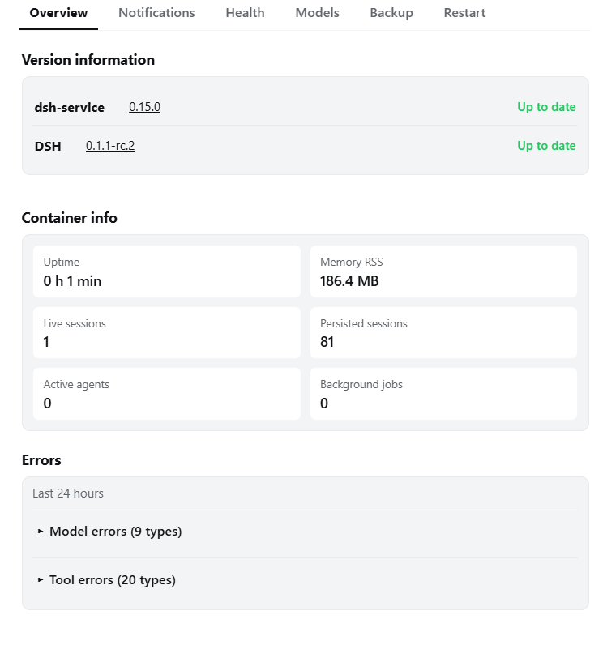
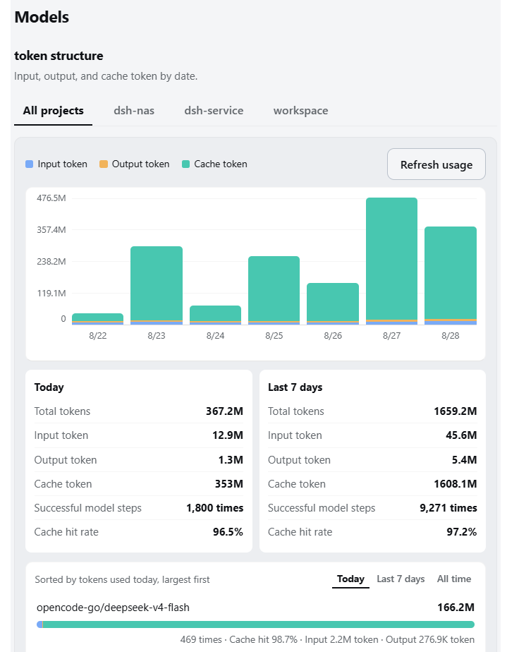
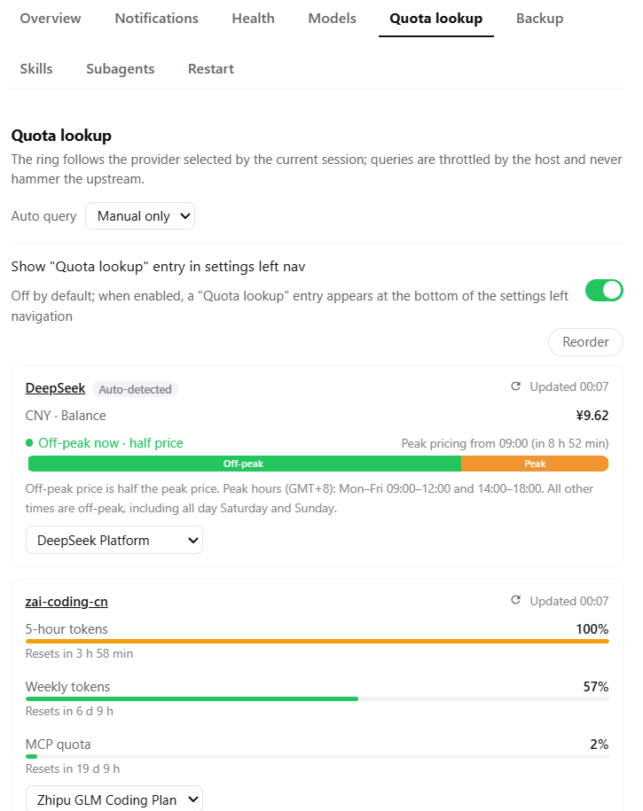
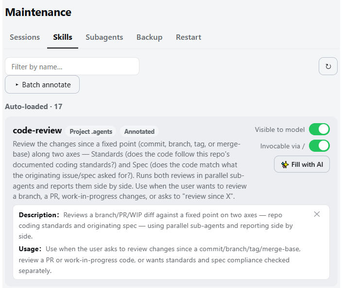
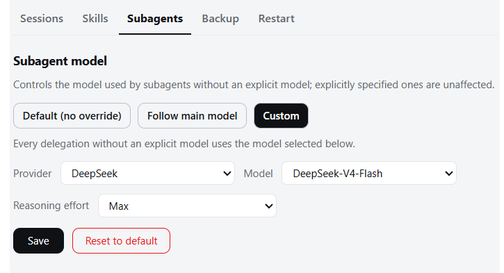
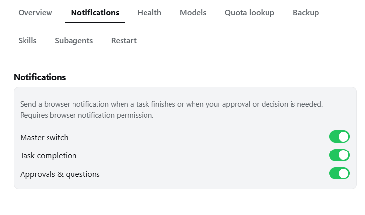

# dsh-service

[中文](./README.md)

A service-control and operations plugin for self-hosted DSH Web. Provides safe restart, version management and one-click upgrade, health diagnostics, model-usage statistics, remote quota, backup management, task notifications, and Linux file-permission maintenance.



## Features

The Settings panel "Service Control" page has nine top-level tabs: **Overview, Notifications, Health, Model stats, Quota lookup, Backups, Skills, Subagents, Restart**; the Restart, Quota lookup, Skills, and Subagents tabs can each enable a quick entry at the bottom of the settings left navigation (off by default).

The plugin also appears under **Plugins → Plugin configuration**, with seven host-level switches enabled by default: **Model statistics, Quota lookup, Backup maintenance, Task notifications, Skill manager, Subagent model, and the `/healthz` liveness endpoint**. Disabling one hides its UI, stops the associated polling/subscriptions, and makes the Host reject that capability; Overview, Health diagnostics, and Restart remain available. All seven switches are live settings: disabling or re-enabling them requires neither a page reload nor a DSH Web restart. Statistics refreshes, quota requests, or backup operations already in flight are allowed to finish; quota re-enablement preserves existing cache, TTL, and backoff state, so its UI and calls return immediately but a new upstream request is not guaranteed at once.

### Version and updates

- Displays current DSH and plugin versions with links to GitHub Releases
- Automatically checks npm registry for stable and preview releases; when a new version exists, the right-side status text (chevron + `New version`) is clickable to expand/collapse, showing the current/latest versions and both dist-tag versions inline, each with npmjs and npmmirror links (npmjs.com is blocked on some networks; npmmirror serves as the mirror entry)
- One-click plugin upgrade with automatic restart after completion; when no process manager is detected (for example, a manual launch from a Windows terminal), the upgrade first confirms the consequences, then keeps the process running and shows manual-restart instructions

### Safe restart

- Detects active agents, background jobs, and terminals before restart; lists them and requires explicit confirmation
- `/restart` command also available in conversations; automatically refuses when active work is detected
- Automatically probes for the new process after restart and reloads the page; manual reload available after 60 seconds
- When a manual terminal launch is suspected, the restart confirmation flow warns that nothing will bring the process back, and Health diagnostics marks it with a yellow inline caution
- Optional `Restart` entry at the bottom of the settings left navigation, enabled by a switch in the Restart tab (off by default), sharing the exact same confirmation flow as the Restart tab

### Health diagnostics

- Shows uptime, memory, session count, active agents, and background jobs
- The "Process and runtime" card shows platform, architecture, and Node version
- Full diagnostics check session storage, workspace registry, backup storage, tar availability, file permissions, runtime environment, and Node runtime version; a manual launch is marked with a yellow inline caution (no restart assurance) that does not trigger the health alert banner, the service-control reminder, or the tab ⚠; an unrecognized environment and an empty backup list are informational only — all can be declared explicitly via `DSH_SERVICE_RUNTIME_ENV`
- Having no backups is an informational note, not a warning, and does not light the Health tab ⚠
- File-permission deep scan and repair: checks whether the Agent can read/write DSH_HOME and workspaces; repair requires two-step confirmation

### Model statistics



- 7-day stacked bar chart of input/output/cache tokens with blue/orange/teal legend
- Filter by project; hover for exact values
- Model breakdown as horizontal stacked bars (same legend colors) with a "Today / Last 7 days / All time" toggle on the right of the list header (default: last 7 days): Today aggregates only the current day, Last 7 days ranks within the chart's window, and All time covers every date in the index (bounded by session retention); each row keeps `x times · Cache hit x% · Input xM token · Output xM token`
- Steps whose provider reports no token usage are excluded from the statistics
- Last-24-hour model/tool error statistics, collapsed by default

### Quota lookup



- A dedicated "Quota lookup" tab shows adapted providers as separate cards, each window rendered as a percentage with its own bar and a reset countdown on its own line, plus a refresh icon beside the updated time that force-refreshes that provider on click (bypassing the poll interval); adapted card titles link to the provider's official usage page (DeepSeek Platform, Zhipu GLM Coding Plan, OpenCode Go) in a new tab; a "Reorder" toggle at the top-right of the card list (shown with two or more cards) reveals ↑/↓ buttons on each card header (auto-disabled at the ends), and clicking it again hides them; the order is remembered in this browser and newly seen providers append at the end; unadapted providers take no space — a "Manual adapt" row at the bottom enables one by picking its type, and each card's footer can switch type, fall back to auto-detect, or disable lookup at any time
- A quota ring inside the conversation composer follows the provider selected by the current session and shows the tightest budget window as a percentage (green below 80%, amber at or above); clicking opens a panel headed by the provider name, with a bar and used percentage for each window and reset times on their own lines; on narrow viewports (phones) the panel switches to a viewport-centered floating layer — fully visible, scrolling internally when too tall — and rotates or resizing wider flips it back to the anchored placement above the ring
- A "Show a remote quota entry in the settings left navigation" switch lives in the Quota lookup tab (off by default), mirroring the Restart entry
- Built-in adaptations: **OpenCode Go** (`{baseURL}/usage`), **Zhipu GLM Coding Plan / zai-coding-cn** (official monitor `quota/limit` endpoint with three windows — 5-hour rolling tokens, weekly tokens, monthly MCP quota; an idle 5-hour window hides its reset time, matching the official console), **OpenRouter** (credits used %), **Kimi/Moonshot** and **SiliconFlow** (CNY balance text), **DeepSeek Platform** (official balance, see next bullet); dialects that natively report remaining percentage flip the panel word to "Remaining" and invert the warn threshold; transient network errors retry automatically and the Zhipu dual-domain candidate chain switches automatically; the provider-to-kind mapping lives in `DSH_HOME/dsh-service-quota.json`, and known services are auto-detected from their baseURL (e.g. opencode.ai, bigmodel.cn, api.deepseek.com) with no manual picking; no upstream request is ever made for unadapted or disabled providers; disabling can be done via "Disable" in a card's footer or by writing `"<provider>": null` in the config file (both are equivalent). Zhipu reset cards have no API-key-queryable endpoint yet — you can add any number of them via each provider card's "Add reset card" button on the tab (name plus expiry time, down to the minute), and remove each one independently — the ring panel shows them too (stored in the same config file); expired cards are flagged automatically
- **DeepSeek official balance with peak/off-peak hint (deepseek)**: calls DeepSeek Platform's official `GET /user/balance` and shows the total balance per currency (CNY→¥, USD→$), plus a separate "Granted balance" line whenever unexpired granted credit is positive; each DeepSeek card embeds a **peak/off-peak block** — a status badge on top (orange = "Peak now · standard price", green = "Off-peak now · half price") with a countdown to the next switch in Beijing time (e.g. "Peak pricing from 09:00 (in 12 h 41 min)", correctly spanning weekends to Monday's morning peak), below it a two-segment ribbon: the first block is the remainder of the current period and the second is the next opposite period (spanning days when needed — e.g. Friday evening draws straight to Monday's morning peak), widths proportional to actual durations with the left edge marking "now"; blocks are tagged inline as Peak / Off-peak, advancing every 30 seconds, and a caption stating the official rule "off-peak price is half the peak price"; the ring panel shows a compact version without the caption. Credentials resolve via the `DEEPSEEK_API_KEY` hint from the DSH credential store or environment variables, or can be written directly through the card's credential form. DSH's built-in `@deepseek-ai/dsh-llm-deepseek` official channel (the DeepSeek V4 models in the model picker, route id `deepseek-official`) needs **no extra settings route** — the quota lookup merges that runtime channel automatically and adapts it to the official balance endpoint, so the ring also appears when you switch to one of its models
- **CLIProxyAPI accounts (cliproxy)**: queries the **official remaining quota** of each OAuth upstream account inside a CLIProxyAPI (CPA) deployment (Codex 5-hour/weekly windows, per-model quotas for GeminiCLI and Antigravity) — not proxy-key usage. Prerequisites: CPA's `remote-management.secret-key` must be set (the whole management API is unavailable without it), remote access requires `allow-remote-management`, and the management secret goes into the DSH credential store as `CPA_MANAGEMENT_KEY` or an environment variable of the same name — it is independent of the proxy API key, and the plugin never sends the proxy key to the management plane. When you save the "CLIProxyAPI accounts" adaptation, the plugin pins the hostname of that provider's settings baseURL into the config file and afterwards only sends requests to that pinned domain (re-save the adaptation after changing baseURL); a single refresh queries at most 8 accounts (disabled accounts and account types without a supported quota endpoint are skipped automatically), and failures on some accounts do not affect the rest. Note that CPA's management plane has built-in key throttling — 5 wrong attempts ban your IP for 30 minutes — so make sure the secret is correct before testing
- Credential fill-in form: when an adapted provider shows "credential missing", its card offers an inline form — regular adaptations show **"Set API credential"**, while the CLIProxyAPI adaptation shows **"Set management key (web login key)"** (the remote-management secret you use to log into CPA's web management UI — not the proxy API key, which the management plane bans wrong attempts for); the credential name comes from a host-derived whitelist per adaptation type (CLIProxyAPI only ever offers `CPA_MANAGEMENT_KEY`/`CLIPROXY_MANAGEMENT_KEY` — these are **alias slots for the same secret; storing one is enough**, discovery takes the first configured value in order; the primary name is marked and the form defaults to a configured slot. Never the proxy key); saving writes the value into the DSH credential provider (the `refs:` section of `$DSH_HOME/.credentials.yaml`, hot-effective without restarts) and then force-refreshes that provider; the form can also clear a stored file-layer credential in one click. If a process environment variable is currently shadowing that name, the host refuses the write (credential-store contract) — change the environment variable itself instead
- Anti-rate-limit pacing is enforced by the host: successful results are cached for 60 seconds (shared across tabs), failures back off exponentially (30 s doubling, capped at 15 minutes), upstream timeout is 15 s; the panel can set auto query to manual only / 1 / 2 / 5 / 10 minutes (manual only by default), paused automatically while the page is hidden
- API keys are resolved and used only inside the host process — the browser receives normalized window data (percentages or balance text) only; data flows through the plugin's own loopback RPC with no webServer routes exposed

### Backup management

- Creates `.tar.gz` archives of sessions, configuration, and plugin profile manifests
- Export: download backup to browser
- Restore: extract and overwrite to corresponding paths, two-step confirmation followed by automatic restart
- Import: upload a `.tar.gz` file to the backup directory
- Delete requires two-step confirmation; backups are unlimited and never auto-pruned

### Skills management



- The "Skills" tab lists every local skill under three sections — **auto-loaded / manual-only / fully disabled** — scanning project `.dsh`, project `.agents`, user `~/.dsh/skills`, `$DSH_AGENTS_HOME`, and `$DSH_BUNDLED_SKILL_DIR` roots one level deep, with a name filter and source badges; same-name shadowing (lower rank wins) marks both winner and loser copies, bundled directories are shown read-only, and a physical directory hit by multiple root rules is counted once
- Two per-entry switches edit the SKILL.md frontmatter directly: `disable-model-invocation` for "visible to model", `user-invocable` for "invocable via /"; switches use a two-click confirmation, changes go live within ~200 ms, active sessions receive a catalog-update notice on their next step, and toggling back and forth leaves no residue in the file
- Entries carrying legacy camelCase invocation keys (e.g. `disableModelInvocation`) are dropped entirely by the official parser: the panel shows a ⚠ warning and a two-click confirmed fix that converts them to canonical keys semantically
- "Fill with AI" (✨): pick any configured model (last choice remembered); the Host calls it with a fixed template to draft description and usage **in the DSH UI language** (Simplified Chinese in Chinese environments, English in English ones); the draft is previewed old-vs-new and saved after explicit confirmation as an "AI note". Notes live only in the plugin sidecar index `DSH_HOME/dsh-service-skills-index.json` and **never modify SKILL.md** — they render under their entry on the Skills tab only (with a remove button); a body change marks the note stale for refilling
- One-click batch fill: automatically collects unannotated skills or ones whose body changed (read-only roots included; invalid entries and shadowed copies are skipped), shows candidate count / estimated payload and an expandable per-entry skip list first, then runs sequentially with live progress; individual failures never block the batch, and cancelling immediately interrupts the in-flight model call. Zero file modifications throughout, and the plugin never issues model calls autonomously
- Batch runs in the Host background: switching tabs, closing the settings panel, or even refreshing the page never interrupts it; returning to the Skills tab restores progress and the cancel button, the Skills tab title shows a live `⟳done/total` badge while running, and planning a second batch mid-run is explicitly rejected

### Subagent model



- The "Subagents" tab controls routing for delegations that **did not explicitly specify a model**, with three modes: **Default (no override)** injects nothing and preserves DSH's native inheritance; **Follow main model** reads the provider/model actually used by the main conversation's latest request at delegation time; **Custom** pins every unspecified subagent to the selected provider and model
- A provider or model explicitly carried by the delegation always wins, so the plugin never overrides a pinned preset, call arguments, or a route already injected by another plugin. Custom choices come exclusively from the Host's live model catalog; if that provider is later removed, delegation safely falls back to native inheritance instead of failing
- Configuration is stored in `$DSH_HOME/dsh-service-subagent-route.json` (atomic writes, file mode `0600`); "Reset to default" clears the custom route and restores zero intervention. An optional "Subagents" quick entry can be enabled for the settings left navigation (off by default)

### Task notifications



- Notification settings live in the top-level Notifications tab: browser notification when a session finishes its turn, or when your approval, plan review, or answer is needed
- Clicking a notification focuses the DSH page and closes the popup
- Three toggle switches: master switch, task completion, and approvals & questions, each controlled independently
- Bell icon in the conversation input bar toggles the master switch quickly
- All toggles persist across page reloads

### External liveness probe

- `GET` / `HEAD /healthz` returns empty HTTP 200; other methods return 405
- Suitable for Uptime Kuma, Docker, Kubernetes, or other external monitors

## Installation

### Install from npm (recommended)

```sh
dsh plugin --profile web add @gehennawu/dsh-service
```

### Install from GitHub

```sh
dsh plugin --profile web add github:gehennawu/dsh-service
```

Restart DSH Web after installation or updates:

```sh
dsh web
```

Open DSH Web Settings and select **Service Control**.

### Local development install

```sh
dsh plugin --profile web add link:/path/to/dsh-service
```

## Automatic restart configuration

The plugin only sends an exit signal; it does not start the process again. Without a process manager, selecting restart stops DSH Web.

The plugin passively detects whether a process manager is present (environment variables, `/.dockerenv`, `/proc/1/cgroup`, terminal TTY): with Docker/systemd/pm2/supervisord/Kubernetes detected it restarts as usual; when nothing is detected and stdin/stdout are an interactive terminal, it treats the environment as a likely manual launch, flags it in Health diagnostics with a yellow caution, and switches one-click upgrade to keep the process running with manual-restart instructions. Heuristics cannot cover redirected output or wrappers like NSSM/WinSW; set `DSH_SERVICE_RUNTIME_ENV=managed|manual` to declare it explicitly.

### Docker Compose

```yaml
services:
  dsh:
    restart: unless-stopped
```

### systemd

```ini
[Service]
ExecStart=/usr/local/bin/dsh web --host 127.0.0.1
Restart=on-failure
RestartSec=2
```

### pm2

```sh
pm2 start "dsh web --host 127.0.0.1" --name dsh-web
```

## Platform support

| Environment | Plugin features | Automatic recovery | Verification |
| --- | --- | --- | --- |
| Linux + Docker Compose | Supported | Supported with a restart policy | Verified |
| Linux + systemd / pm2 | Expected to work | Managed externally | Not separately tested |
| macOS / Windows + pm2 or similar | Not blocked by the code | Managed externally | Not tested |
| Direct `dsh web` execution | Supported | Not supported | Expected behavior |

When launched directly from a terminal (PowerShell/CMD/bash), the panel labels the environment as a likely manual launch and the one-click upgrade no longer exits the process automatically.

Requirements: Node.js `>=22`, and a DSH Web installation capable of loading both Host and Client plugin halves. Update checks require access to `registry.npmjs.org`; network failures do not affect other features.

## Security design

- The browser cannot supply URLs, package names, commands, or file paths
- Update checks only access fixed npm registry endpoints
- The RPC channel is loopback-only
- The model-usage index stores no messages, prompts, tool arguments, or credentials
- Destructive operations (restart, delete, permission repair) all require two-step confirmation

## License

[MIT](./LICENSE)
