<div align="center">

[English](./README.en.md)

# 🛠️ dsh-service

<p align="center">
  <strong>DeepSeek Harness (DSH) Web 服务控制与运维插件</strong><br>
  <em>A service-control &amp; operations plugin for DeepSeek Harness (DSH) Web.</em>
</p>

[](package.json)
[](LICENSE)
[](https://github.com/deepseek-ai/deepseek-harness)
[](https://cordis.moe/)
[](https://github.com/gehennawu/dsh-service)
[](https://github.com/gehennawu/dsh-service/issues)
[](https://awesome-dsh-plugin.com)

<p align="center">
  <a href="#-功能">功能</a> •
  <a href="#-架构">架构</a> •
  <a href="#-安装">安装</a> •
  <a href="#-自动重启配置">自动重启配置</a> •
  <a href="#-平台支持">平台支持</a> •
  <a href="#-安全设计">安全设计</a> •
  <a href="#-常见问题-faq">常见问题 FAQ</a> •
  <a href="#-参与贡献">参与贡献</a> •
  <a href="#-许可证">许可证</a>
</p>

---

</div>

DSH Web 服务控制与运维插件：安全重启、版本管理与一键升级、健康诊断、模型用量统计、额度查询、备份管理、任务通知、技能管理、会话管理与 Linux 文件权限维护。


## 📑 目录

- [🚀 功能](#-功能)
  - [版本与更新](#版本与更新) · [安全重启](#安全重启) · [健康诊断](#健康诊断) · [模型统计](#模型统计)
  - [额度查询](#额度查询) · [备份管理](#备份管理) · [技能管理](#技能管理) · [子代理模型](#子代理模型)
  - [任务通知](#任务通知) · [会话管理](#会话管理) · [移动端适配](#移动端适配) · [外部探活](#外部探活)
- [🏗️ 架构](#-架构)
- [⚡ 安装](#-安装) · [🔄 自动重启配置](#-自动重启配置) · [🖥️ 平台支持](#-平台支持)
- [🔒 安全设计](#-安全设计) · [❓ 常见问题 FAQ](#-常见问题-faq) · [🤝 参与贡献](#-参与贡献) · [📄 许可证](#-许可证)

## 🚀 功能

设置页「服务控制」面板六页导航：**概览 · 模型统计 · 额度查询 · 健康诊断 · 维护 · 配置**；其中「维护」聚合 会话管理 · 技能 · 子代理 · 备份维护 · 重启 五个子页，「配置」聚合 功能开关 · 任务通知 两个子页。重启、额度查询、会话管理可另行开启**设置页左列快捷入口**（默认关闭；技能与子代理的左列入口已撤销）。

「插件 → 插件配置」提供十个宿主级开关：**健康诊断、模型统计、额度查询、备份维护、任务通知、技能管理、子代理模型、会话管理、移动端适配、`/healthz` 探活**（除移动端适配外默认开启）。全部热生效：关闭即隐藏界面、停止轮询并让宿主拒绝对应能力；概览与重启固定保留。


### 概览（六段式）

- 状态摘要（error → warning → info → normal 聚合，带状态点）→ 可行动项（仅在存在时）→ 版本与运行环境 → 指标格 → 固定核心操作（健康检查 / 额度查询 / 创建备份，随功能开关门控）→ 近期报错（仅非空时渲染，默认折叠）
- 状态聚合规则：健康/诊断/备份/统计/额度/重启任一失败即 error；权限异常、非咨询性诊断警告、额度窗口使用率 ≥80% 为 warning；可更新、手动启动环境、尚无备份为 info

### 维护与配置聚合页

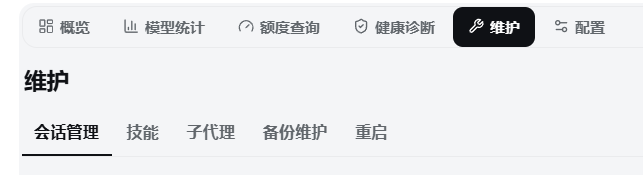

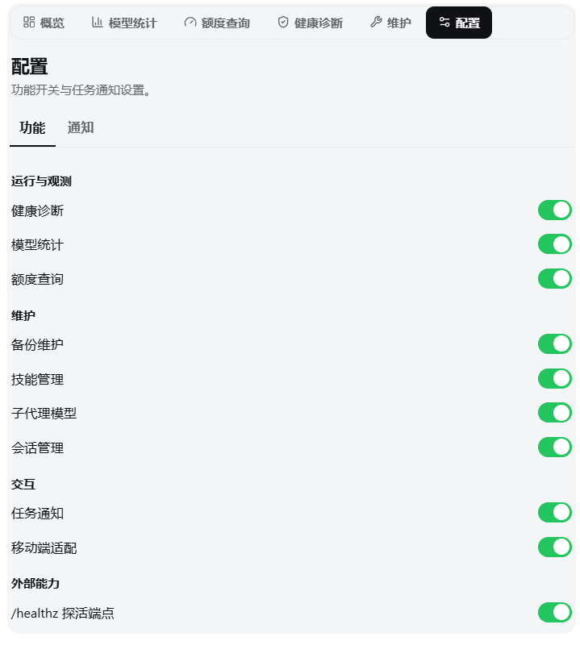

- 「维护」集中会话管理、技能、子代理、备份维护与重启；记住最近使用的子页，关闭对应功能后自动回退到仍可用的项目
- 「配置」集中功能开关与任务通知；开关按功能组展示并热生效，任务通知关闭时保留入口但显示置灰状态

### 版本与更新

- 显示当前 DSH 与插件版本，链接 GitHub Releases
- 自动检查 npm **正式版 + 预览版**（latest / next 双 tag）；有新版本时行内展开对比，版本号附 npmjs 与 npmmirror 双链接
- 一键升级，完成后自动重启；未检测到进程管理器时先确认后果，保持运行并提示手动重启

### 安全重启

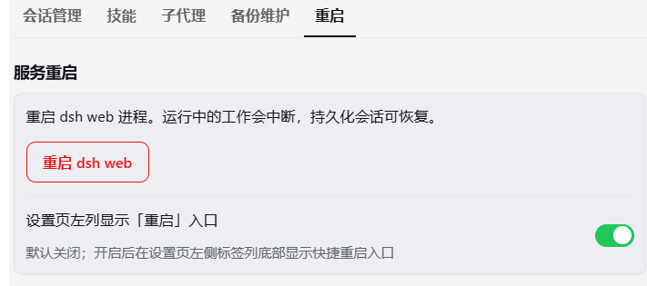

- 重启前检测活跃 Agent、后台任务与终端，展示清单并要求显式确认
- 对话输入 `/restart` 也可触发；检测到运行中工作时自动拒绝
- 重启后自动探测新进程并刷新页面，60 秒未恢复提供手动刷新
- 可开启「设置页左列显示入口」（默认关闭），与「维护 → 重启」子页共用同一确认流程
- 疑似终端手动启动时提示「退出后不会自动拉起」，健康诊断以黄色警示标注

### 健康诊断

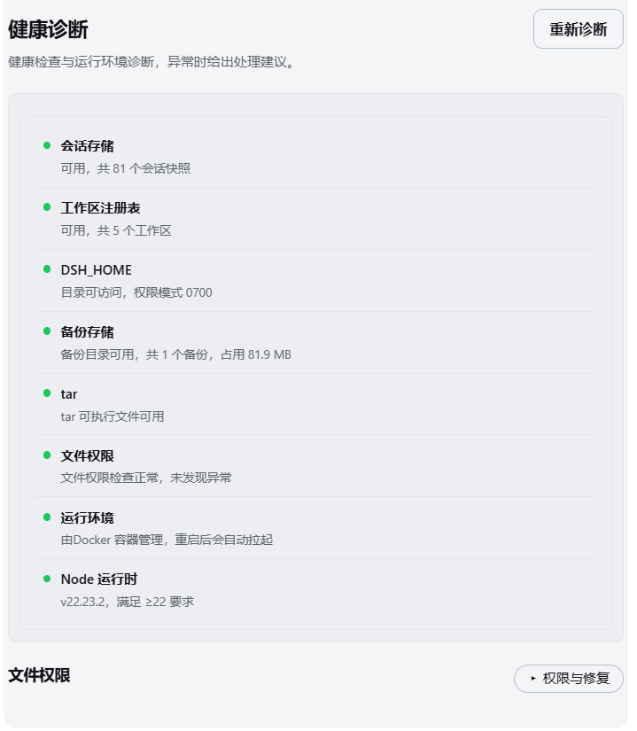

- 运行时间、内存、会话数、活跃 Agent 与后台任务；「进程与运行环境」卡显示平台、架构与 Node 版本
- 完整诊断：会话存储、工作区注册表、备份目录、tar 可用性、文件权限、运行环境与 Node 版本——**两行检查清单**（检查名+状态点 / 详情），异常行局部淡染强调、正常行低对比
- 文件权限深检与修复（两段式确认）收敛在**默认折叠**的「权限与修复」区（有异常时按钮显示计数）
- 疑似手动启动 → 黄色警示「重启无保障」；无备份属信息级提示，不点亮 ⚠

### 模型统计

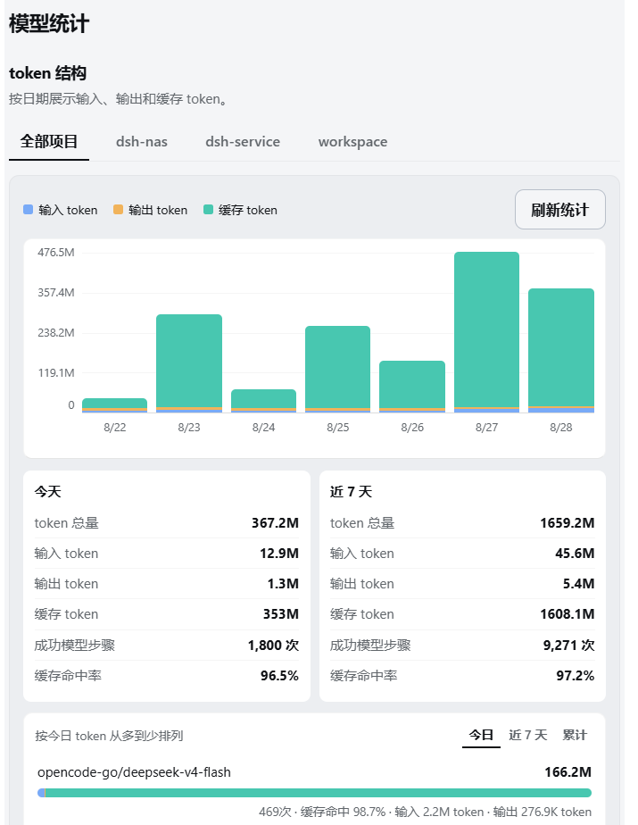

- 近 7 天输入 / 输出 / 缓存 token 堆叠柱图，按项目筛选、悬停显示精确值；**图例与刷新统一收进统计区头部行**，图表带可访问的文本摘要
- 模型明细横条，列表头部「今日 / 近 7 天 / 累计」切换
- 最近 24 小时模型 / 工具报错统计（默认折叠、仅非空渲染）
- 提供方未上报 token 用量的步骤不纳入统计

### 额度查询

- 供应商卡片保留既有窗口展示（标签+百分比 / 独立进度条 / 重置倒计时）；**高级配置**（凭据填写、类型切换、手动重置录入）默认折叠，按卡展开

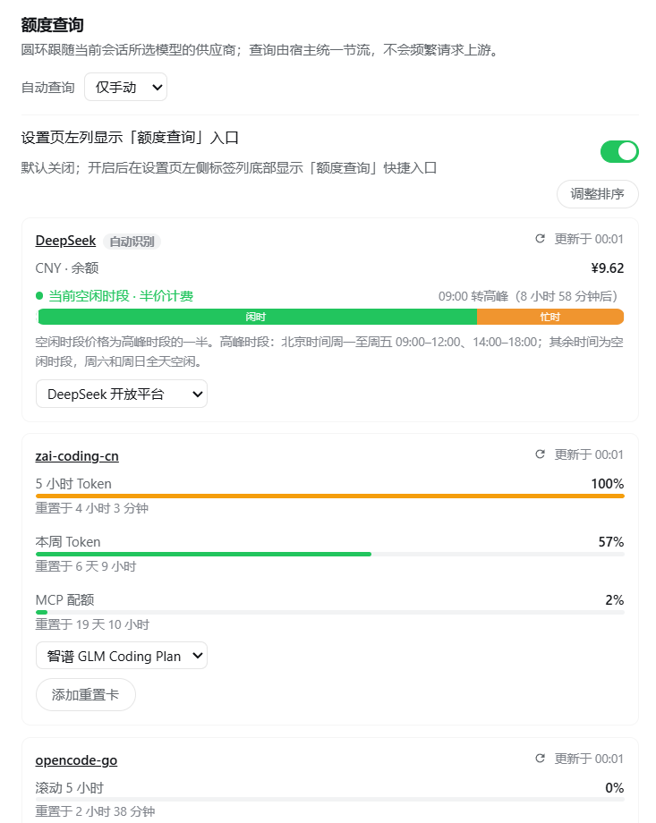

- 卡片分区展示各供应商：窗口百分比、独立进度条、重置时间；支持强制刷新、官网用量页链接与卡片排序
- 对话输入框**额度圆环**：跟随当前会话模型所属供应商，显示最紧预算窗口用量（<80% 绿、≥80% 黄）；点击弹出详情面板，窄屏自动切换为居中浮层
- 内置适配：

| 供应商 | 数据来源 |
| --- | --- |
| DeepSeek 开放平台 | 官方余额 + 峰谷时段提示（忙/闲色带、换挡倒计时） |
| 智谱 GLM Coding Plan | 官方端点：5 小时滚动 / 每周 / MCP 月度三窗口 |
| OpenCode Go | `{baseURL}/usage` |
| OpenRouter | credits 已用百分比 |
| Kimi / 硅基流动 | 人民币余额 |
| StepFun 余额 | 官方 `GET /v1/accounts`（API key，com/ai 双域） |
| StepFun Step Plan | 控制台 BFF 订阅额度（Oasis-Token 登录令牌；5 小时/周窗口与 Credit 月池自动识别） |
| 小米 MiMo Token Plan | 控制台同源套餐额度（网页登录态 Cookie） |
| CLIProxyAPI 部署 | 各 OAuth 上游账号官方剩余额度 |

- 凭据写入 DSH 凭据库（`$DSH_HOME/.credentials.yaml`，热生效）：普通适配填 API key，CLIProxyAPI 填管理密钥，小米填控制台 Cookie，StepFun Step Plan 填控制台令牌（Oasis-Token，`Oasis-Webid` 由令牌自动派生无需手填）
- 防风控：结果缓存 60 秒、失败指数退避（30 秒 ×2、封顶 15 分钟）；自动查询可调为仅手动 / 1 / 2 / 5 / 10 分钟
- API key 只在宿主进程内解析，浏览器仅收到归一化窗口数据；未适配的供应商绝不发起请求

### 备份管理


- 备份记录列表为两行轻行（文件名主行 + 体积 · 时间次行，分隔线布局；会话管理列表同款）

- 创建会话、配置与插件 profile 清单的 `.tar.gz` 归档；会话经持久化层稳定快照（活跃 agent 写入不再导致失败），创建过程以单条连续进度条分阶段显示（复制/打包/校验/发布，带步骤号 1/4–4/4，复制阶段为真实百分比）
- 导出下载 / 导入上传 / 删除（两段式确认）；不限份数、不自动清理；导入归档必须先通过与恢复相同的完整性检查
- **完整性检查**：恢复前校验 gzip/tar、路径与条目类型，只接受 `sessions`、三份允许配置和 `profiles/<name>/package.json`；拒绝越界路径、链接、特殊文件、未知内容、损坏归档与非法 profile 清单
- **恢复预检**：先生成 5 分钟有效的一次性计划，展示会话整体替换、配置覆盖/移除和 profile manifest 覆盖清单；最终确认前再次校验归档 SHA-256 与当前目标指纹，发生漂移则拒绝执行
- 恢复提交使用事务日志和回滚目录：会话整体替换，配置按快照精确替换，profile 只更新 package.json 并保留 node_modules/凭据/附件；成功后托管环境自动重启，手动启动环境提示用户手动重启

### 技能管理

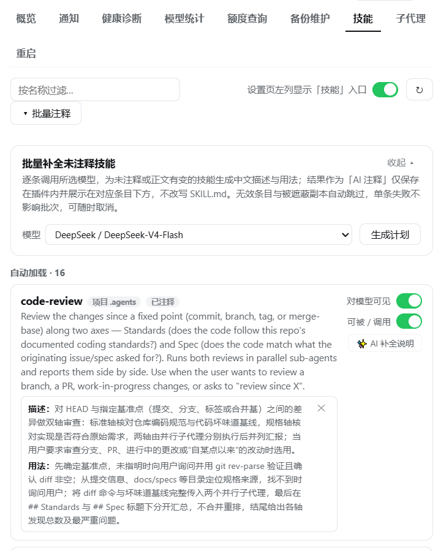

- 按 **自动加载 / 仅手动调用 / 完全停用** 三区展示本地技能；同名遮蔽与被遮蔽副本均有标注，内置目录只读
- 双开关直接改写 SKILL.md frontmatter（`disable-model-invocation` / `user-invocable`），约 200ms 热生效
- 带 camelCase 旧版键的条目会被官方解析器剔除：⚠ 提示 + 一键修复
- ✨ AI 补全说明：选模型生成描述草稿（跟随界面语言），确认后存入插件侧车索引——**绝不改写 SKILL.md**；支持一键批量补全（宿主后台运行、可取消）。已注释技能会在计划中单列，经「确认强制补全」二次确认后才会被覆盖（不再是一旦注释就永远无法再次补全）；补全日志时间按本机时区显示

### 子代理模型

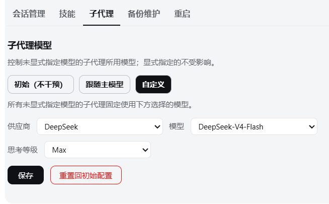

- 三种模式：**初始**（不干预）/ **跟随主模型**（取主对话最近一次实际使用的 provider/model）/ **自定义**（固定到所选模型）
- 派生请求自带 provider/model 时始终优先，绝不覆盖预设钉死
- 自定义模式可选**思考等级**：仅当所选的 **exact provider/model** 由适配器声明了可选等级时才显示下拉；留空表示「使用目标模型默认」，由适配器在请求时物化默认值
- 该字段来自适配器 metadata（`reasoning.efforts[].id`），等级 ID 对宿主不透明；无等级声明的模型禁用下拉并提示
- **inherit / follow / 功能开关关闭** 均不注入任何 provider、model 或思考等级；显式指定 provider/model 的子代理不受影响
- **回退模型（按顺序）**：跟随与自定义模式都可配置回退列表——第一路由不可用时（渠道已卸载、额度查询判定其不可服务）依次尝试后续模型；全部不可用则回落原生继承，不让派生失败。回退条目与主路由同一道白名单校验，思考等级逐条可选
- 配置存 `$DSH_HOME/dsh-service-subagent-route.json`（原子写入、`0600`），可一键重置

### 任务通知

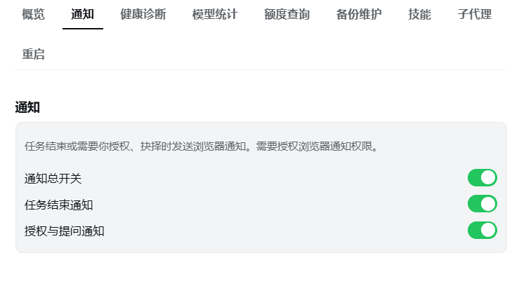

- 主会话完成一轮任务、或会话需要授权 / 审阅计划 / 回答问题时发送浏览器通知；子代理完成任务不发送完成通知；点击通知聚焦页面
- 子代理触发授权 / 审阅计划 / 回答问题时仍发送浏览器通知
- 四档独立开关：总开关、任务完成、授权与提问、输入框铃铛显隐
- 对话栏铃铛一键开关总通知；所有开关刷新后保持

### 会话管理

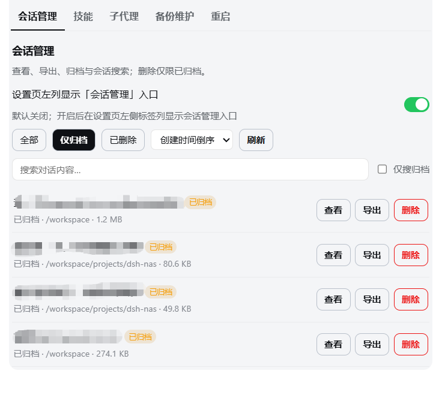

- **查看**：统一列表展示会话（运行中 / 冷会话 / 已归档），行内标状态徽章、工作区、事件数、文件体积；**默认停在「仅归档」视图**，全部 / 仅归档 / 已删除三个筛选各自**首次**按需向宿主拉取对应子集并缓存（模块级缓存：切换筛选零请求、**关掉面板再打开秒显缓存 + 后台静默刷新一次保鲜**，页面刷新才清零），「刷新」按钮可强制重拉当前视图；普通列表提供「批量选择」按钮，进入后可直接点击整条会话（无需精确点复选框）进行选择 / 取消选择，也可一键全选 / 取消全选当前筛选结果，选中行以左侧品牌色标记而不改变背景；工具栏按资格显示可执行数量并支持批量导出 / 归档 / 删除（切换筛选、搜索或进入详情会自动退出批量态）；文件体积不随列表下发、行内按需懒加载（模块级 + 宿主进程内存双层缓存：刷新浏览器 / 重开面板直接复用，删除时失效）；**进详情记住列表滚动位置，返回列表原地不动**（沿用官方面板滚动容器，详情期间切筛选 / 改搜索则放弃恢复）；详情按事件卡片分页浏览（宿主单槽位快照缓存：翻页/重进详情零重复读取，live 会话 30 秒内保鲜），**正文按官方 Markdown 富文本渲染**（复用平台官方渲染器 `MarkdownText`，与聊天界面观感一致：代码块/列表/表格/数学公式、默认拒原始 HTML 与危险链接；老版本 DSH 未提供该渲染器时自动回落纯文本），连续系统事件默认折叠为计数块、点击展开明细
- **导出**：一键或批量下载官方完整 ZIP（每个会话一个 ZIP，含子代理与附件），复用官方导出链路，宿主不自己拼包
- **归档**：单项或批量归档非运行中会话；归档后从官方侧栏隐藏（官方行为），官方不支持恢复
- **内容搜索**：对话全文语义搜索（大小写不敏感、空白灵活），跨会话命中列表（匹配文本高亮；多命中显示 seq 位置芯片、可一键直达）→ **命中窗口视图**：打开即以命中 seq 为中心展示上下文窗口（命中前后各 15 条事件；命中行标「命中」徽章高亮、**自动滚动定位并闪烁 2 秒**），支持**上一个 / 下一个命中**翻跳与导航条 seq 芯片直达（参考 dsh-session-kb 的 Locate 交互）；窗口可继续加载后续事件；可限定仅搜归档区
- **删除**：仅已归档会话可删除，且执行前再次拒绝运行中的会话；两段式确认先展示会话 id / 标题 / 工作区 / 文件体积，删除记录先原子落盘、再移除日志目录；已删除记录在「已删除」筛选下可见（只读）
- 入口：「维护」页子标签「会话管理」（默认开），设置页左列入口可选（默认关）
- 删除记录存 `$DSH_HOME/dsh-service-sessions-deleted.json`（原子写入、`0600`，仅标题/时间，不含内容、不可恢复）

### 移动端适配

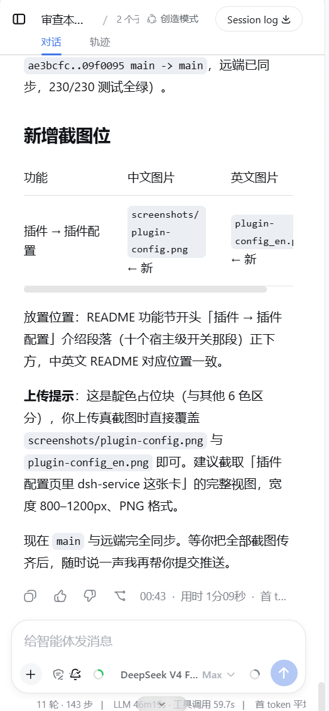

- 默认关闭；仅在视口 <1024px（手机竖屏 / 窄窗口）生效，桌面完全无感
- 侧栏变抽屉、详情列移动端隐藏（对齐官方窄屏语义）、模态变全屏面板、设置左列导航变顶部横滑
- 滑动沉浸：会话内下滑自动收起头部与输入框全屏阅读，上滑 / 回到底部 / 聚焦输入框即恢复，底部常驻小把手可随时点开合；流式贴底、锚点跳转等程序化滚动绝不误触发
- 「回到底部」浮钮右移贴边（不再空出大片右侧留白）；其上方新增同款圆形上箭头（全平台生效，不含移动端），点击逐条跳转上一条用户回复、可连续向上回溯，目标在未加载历史时会自动点「加载更早」补齐，跳到最顶部后按钮自动隐藏、下滑即复现
- 大 JSON 响应透明压缩（≥4KB 按 `Accept-Encoding` 自动 gzip/brotli），长会话历史首屏提速
- 自动补 `viewport-fit=cover` 避让刘海、禁双击缩放、输入框 ≥16px 防 iOS 聚焦放大
- `?dshsvc-mobile-debug=1` 显示浮动诊断条（仅调试）

### 外部探活

- `GET` / `HEAD /healthz` 返回空 200，其他方法返回 405
- 适合 Uptime Kuma、Docker、Kubernetes 等外部监控

## 🏗️ 架构

插件是 Cordis 双半结构：**Host 端（`index.js`）** 承担一切能力与数据访问，**Client 端（`client.js`）** 只在浏览器渲染界面；两侧经 Typert JSON-RPC 通信，通道为单层绝对路径 `/dsh-service`，authority 一律 `loopback`。

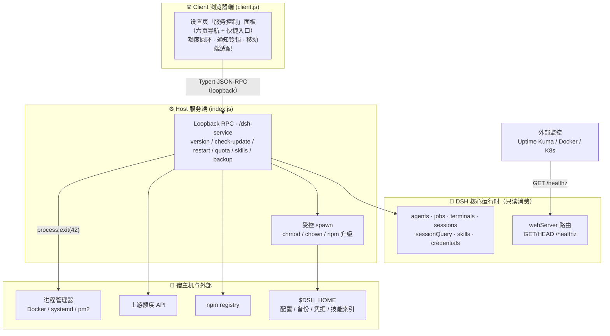

关键契约：

- **仅 loopback**：能力只经 `/dsh-service` loopback channel 暴露；webServer 路由只返回不含信息量的状态码
- **重启 = `process.exit(42)`**：插件只发退出信号，由外层进程管理器拉起；没有管理器时重启无保障
- **零输入拼接**：浏览器侧不接受 URL / 包名 / 命令 / 路径，命令全部走宿主侧白名单
- **凭据不出宿主**：API key 只在宿主进程内解析，浏览器只收到归一化窗口数据

## ⚡ 安装

| 方式 | 命令 |
| --- | --- |
| npm（推荐） | `dsh plugin --profile web add @gehennawu/dsh-service` |
| GitHub | `dsh plugin --profile web add github:gehennawu/dsh-service` |
| 本地开发 | `dsh plugin --profile web add link:/path/to/dsh-service` |

安装或更新后重启 DSH Web：

```sh
dsh web
```

打开 DSH Web 设置页，进入**服务控制**。

## 🔄 自动重启配置

插件只发送退出信号，不负责拉起进程；没有进程管理器时重启会直接停止 DSH Web。

插件以被动信号（环境变量、`/.dockerenv`、`/proc/1/cgroup`、终端 TTY）判断进程管理器：检测到 Docker/systemd/pm2/supervisord/Kubernetes 时照常自动重启；都没有且 stdin/stdout 为交互终端时视为「疑似手动启动」——健康诊断黄色标注、一键升级改为保持运行并提示手动重启。启发式无法覆盖输出重定向、NSSM/WinSW 等场景，可用 `DSH_SERVICE_RUNTIME_ENV=managed|manual` 显式声明。

### Docker Compose

```yaml
services:
  dsh:
    restart: unless-stopped
```

### systemd

```ini
[Service]
ExecStart=/usr/local/bin/dsh web --host 127.0.0.1
Restart=on-failure
RestartSec=2
```

### pm2

```sh
pm2 start "dsh web --host 127.0.0.1" --name dsh-web
```

## 🖥️ 平台支持

| 环境 | 插件功能 | 重启后自动拉起 | 验证状态 |
| --- | --- | --- | --- |
| Linux + Docker Compose | 支持 | 配置 restart policy 后支持 | 已验证 |
| Linux + systemd / pm2 | 预期支持 | 由进程管理器负责 | 未单独验证 |
| macOS / Windows + pm2 等 | 代码未限制 | 由进程管理器负责 | 未验证 |
| 直接运行 `dsh web` | 支持 | 不支持 | 预期行为 |

运行要求：Node.js `>=22`，DSH Web 能加载 Host 与 Client 两半插件。更新检查需访问 `registry.npmjs.org`；网络失败不影响其他功能。

## 🔒 安全设计

| 领域 | 边界 |
| --- | --- |
| 输入 | 浏览器不能传入 URL、包名、命令或文件路径 |
| 网络 | 更新检查只访问固定 npm registry 地址 |
| RPC | 仅接受 loopback 调用，数据不出本机 |
| 数据 | 用量索引不保存消息、Prompt、工具参数或凭据；API key 只在宿主进程内使用 |
| 操作 | 破坏性操作（重启、删除、修复权限）均需两段式确认 |
| 凭据 | 写入 DSH 凭据库（`$DSH_HOME/.credentials.yaml`），只发往固定端点 |

## ❓ 常见问题 FAQ

<details>
<summary><strong>重启后没有自动起来？</strong></summary>

插件只发送退出信号，重新拉起由进程管理器负责（见「自动重启配置」）。面板标注「疑似手动启动」时，直接运行 `dsh web` 的终端进程会被退出；请改用 Docker Compose / systemd / pm2 托管。
</details>

<details>
<summary><strong>健康诊断里的黄色「重启无保障」警告是什么？</strong></summary>

这是「疑似终端手动启动」的检测结果，说明当前没有检测到进程管理器。若实际由 NSSM/WinSW 或输出重定向等场景托管，可用 `DSH_SERVICE_RUNTIME_ENV=managed` 显式声明消除。
</details>

<details>
<summary><strong>额度卡片显示「凭据未配置」？</strong></summary>

点击卡片上的内联表单写入凭据：普通适配填 API key，CLIProxyAPI 填管理密钥（不是代理 key），小米 Token Plan 填控制台 Cookie。写入 DSH 凭据库后自动强制刷新；被进程环境变量遮蔽时宿主会拒绝写入，需改环境变量本身。
</details>

<details>
<summary><strong>小米卡片显示「控制台 Cookie 已失效」？</strong></summary>

网页登录态过期了。重新登录 platform.xiaomimimo.com，从任意 `/api/v1/tokenPlan/` 请求复制 `Cookie:` 头，点卡片「填写控制台 Cookie」重新粘贴。
</details>

<details>
<summary><strong>StepFun Step Plan 卡片显示「凭据未配置」？</strong></summary>

Step Plan 订阅没有 API-key 形态的查询接口，需要网页登录态令牌。登录 platform.stepfun.com，按 F12 打开开发者工具 → Application → Cookies → platform.stepfun.com，复制 `Oasis-Token` 的完整值（形如 `xxx...yyy`，两个小圆点分隔是令牌格式本身的一部分，不要拆分），点卡片「填写控制台令牌（Oasis-Token）」粘贴即可；`Oasis-Webid` 由宿主从令牌自动派生，无需手填。
</details>

<details>
<summary><strong>StepFun Step Plan 卡片显示「控制台登录态已失效」？</strong></summary>

令牌过期了（官方常见报错 `oasis-token is embezzled` 即令牌与 web_id 不匹配）。重新登录 platform.stepfun.com 后从 Cookies 复制新的 `Oasis-Token` 完整值再粘贴；从控制台复制时若自带 `Oasis-Token=` 或 `Cookie: ` 前缀会被自动剥离，不影响。
</details>

<details>
<summary><strong>恢复备份会怎样？</strong></summary>

先做完整性检查并展示恢复预检计划，再由用户最终确认。提交前宿主会复检备份 SHA-256、当前目标指纹与运行中工作；任何变化都会中止，不会部分覆盖或重启。提交成功后会话目录整体替换，允许的配置文件按快照精确替换，profile 只覆盖 package.json（node_modules、凭据、附件不动）。受 Docker/systemd/pm2 等托管时自动重启；疑似终端手动启动时显示手动重启指引。删除备份同样需要两段式确认。
</details>

<details>
<summary><strong>技能开关为什么置灰不可点？</strong></summary>

该技能来自内置（bundled）只读目录。只有 `project-*` 与 `user-*` 来源的技能支持双向开关。
</details>

<details>
<summary><strong>保存技能开关提示「技能文件刚刚发生变化」？</strong></summary>

并发保护生效：SKILL.md 刚被外部编辑器改动（版本比对失败）。点击「刷新」获取最新状态后重试即可。
</details>

<details>
<summary><strong>更新检查失败会影响其他功能吗？</strong></summary>

不会。更新检查只是访问 npm registry 的只读请求，失败静默忽略，其余功能不受影响。
</details>

## 🤝 参与贡献

欢迎提交 Issue 与 Pull Request。开发路线与技术约定见仓库内 AGENTS.md；发布规范见 AGENTS.md「发布」一节。

## 📄 许可证

[MIT](./LICENSE)