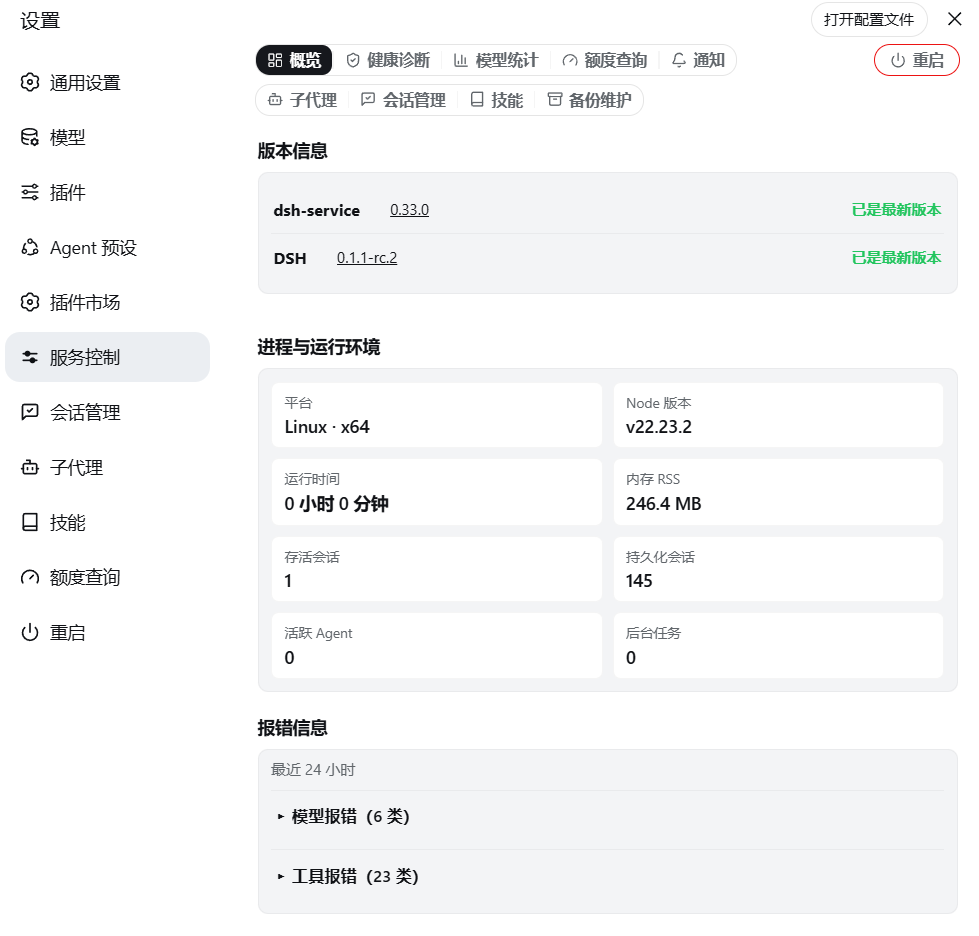

# dsh-service

[English](./README.en.md)

面向自托管 DSH Web 的服务控制与运维插件。提供安全重启、版本管理与一键升级、健康诊断、模型用量统计、备份管理、任务通知和 Linux 文件权限维护。



## 功能

### 版本与更新

- 显示当前 DSH 和插件版本，版本号链接到 GitHub Releases
- 自动检查 npm registry 的正式版和预览版，显示更新状态
- 一键升级插件，升级后自动重启

### 安全重启

- 重启前检测活跃 Agent、后台任务和终端，展示清单并要求显式确认
- 对话中输入 `/restart` 也可触发，检测到运行中工作时自动拒绝
- 重启后自动探测新进程并刷新页面，60 秒未恢复时提供手动刷新
- 设置页左侧标签列底部有常驻的「重启」入口，与「重启」标签共用同一套确认流程

### 健康诊断

- 显示运行时间、内存、会话数、活跃 Agent 和后台任务
- 完整诊断检查会话存储、工作区注册表、备份目录、tar 可用性和文件权限
- 文件权限深检与修复：检查 Agent 是否能读写 DSH_HOME 和工作区，修复需两段式确认

### 模型统计

- 近 7 天输入/输出/缓存 token 堆叠柱图，蓝/橙/青图例
- 按项目筛选，鼠标悬停显示精确数值
- 模型明细按步骤数降序，格式为「x次 · 缓存命中 x% · 输入 xM token · 输出 xM token」
- 最近 24 小时模型/工具报错统计，默认折叠

### 备份管理

- 创建会话、配置和插件 profile 清单的 `.tar.gz` 归档
- 导出：下载备份到浏览器
- 恢复：解压覆盖到对应路径，两段式确认后自动重启
- 导入：选择 `.tar.gz` 文件上传到备份目录
- 删除需两段式确认，备份不限份数，不自动清理

### 任务通知

- 会话完成一轮任务、或需要你授权/审阅计划/选择答案时发送浏览器通知
- 三档开关条：总开关、任务结束通知、授权与提问通知，各自独立控制
- 对话栏内铃铛图标快速切换总开关
- 各开关在页面刷新后保持

### 外部探活

- `GET` / `HEAD /healthz` 返回空的 HTTP 200，其他方法返回 405
- 适合 Uptime Kuma、Docker、Kubernetes 等外部监控

## 安装

### 从 npm 安装（推荐）

```sh
dsh plugin --profile web add @gehennawu/dsh-service
```

### 从 GitHub 安装

```sh
dsh plugin --profile web add github:gehennawu/dsh-service
```

安装或更新后重启 DSH Web：

```sh
dsh web
```

打开 DSH Web 设置页，进入 **服务控制**。

### 本地开发安装

```sh
dsh plugin --profile web add link:/path/to/dsh-service
```

## 自动重启配置

插件只发送退出信号，不负责重新启动进程。没有进程管理器时，点击重启会直接停止 DSH Web。

### Docker Compose

```yaml
services:
  dsh:
    restart: unless-stopped
```

### systemd

```ini
[Service]
ExecStart=/usr/local/bin/dsh web --host 127.0.0.1
Restart=on-failure
RestartSec=2
```

### pm2

```sh
pm2 start "dsh web --host 127.0.0.1" --name dsh-web
```

## 平台支持

| 环境 | 插件功能 | 重启后自动拉起 | 验证状态 |
| --- | --- | --- | --- |
| Linux + Docker Compose | 支持 | 配置 restart policy 后支持 | 已验证 |
| Linux + systemd / pm2 | 预期支持 | 由进程管理器负责 | 未单独验证 |
| macOS / Windows + pm2 等 | 代码未限制 | 由进程管理器负责 | 未验证 |
| 直接运行 `dsh web` | 支持 | 不支持 | 预期行为 |

运行要求：Node.js `>=22`，DSH Web 能加载 Host 和 Client 两半插件。检查更新需要访问 `registry.npmjs.org`；网络失败不影响其他功能。

## 安全设计

- 浏览器端不能传入 URL、包名、命令或文件路径
- 更新检查只访问固定的 npm registry 地址
- RPC channel 仅接受 loopback 调用
- 模型用量索引不保存消息、Prompt、Tool 参数或凭据
- 破坏性操作（重启、删除、修复权限）均需两段式确认

## 许可证

[MIT](./LICENSE)
